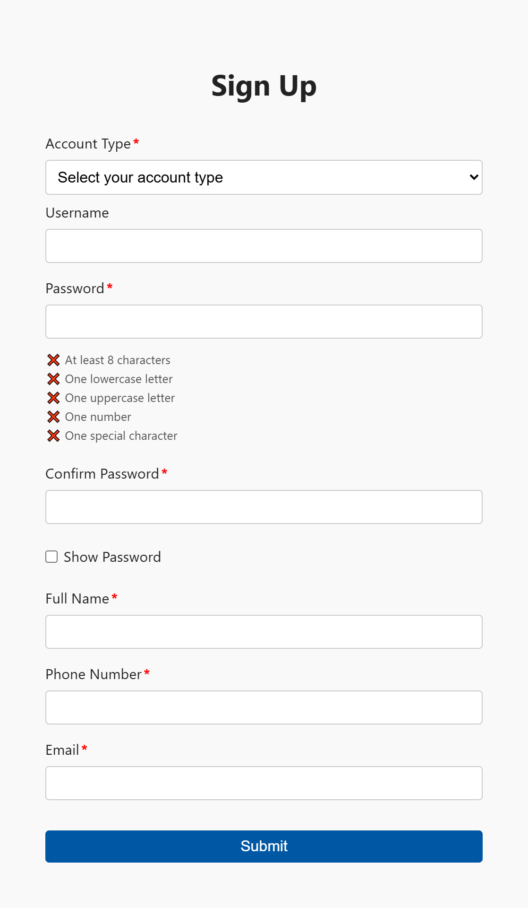

# Expat Tax - User Registration Project

## Overview

This project is a user registration system for "Expat Tax" with a secure frontend form and a PHP backend API.  
It features:  
- Client-side and server-side validation  
- Password strength feedback  
- Rate-limiting mechanism to prevent abuse and brute-force attempts
- SQL injection protection via prepared statements  
- Responsive design and accessibility compliance  
- Ready to deploy on local or hosting platforms like InfinityFree

## Note

- You can view the live demo here: [https://justin-user-registration-app.rf.gd/](https://justin-user-registration-app.rf.gd/)

- Click on details button if there is any, then click on **this unsafe site** 

- If you notice anything unusual, please press **Ctrl + Shift + R** to flush the cache and check the source code again.

---

## Project Structure

```
htdocs/
│
├── index.html                 # Main HTML file, entry point
├── api/                       # PHP backend API folder
│   ├── register.php           # User registration backend script
│   ├── db.php                 # Database connection config
│   ├── rate_limit.php         # Rate limiting logic
│   └── validate.php           # Validation utility endpoints
├── assets/
│   ├── css/
│   │   └── style.css          # Main CSS used by index.html
│   └── js/
│       ├── inputValidation.js # JavaScript form validation functions
│       ├── uiHandler.js       # UI-related dynamic DOM updates
│       └── submitHandler.js   # Form submission logic and request handling
```


---

## Technology Stack

- **Frontend:** HTML5, CSS3, JavaScript (ES6+)
- **Backend:** PHP 7+ with MySQL
- **Database:** MySQL (configured via phpMyAdmin or other tools)
- **Hosting:** Local server (e.g., XAMPP) or InfinityFree (free web hosting)
- **Testing:** Postman for API endpoint testing

---

## Setup and Usage

### 1. Database Setup

- Open your local phpMyAdmin at `http://localhost/phpmyadmin/`
- Create a new database named `registration`
- Run the following SQL to create the `users`, `rate_limit_attempts`, `account_types`, `person_titles` and set up the `MySQL` shedule event if available:

```sql
CREATE DATABASE registration_db;

USE registration_db;

CREATE TABLE
  account_types (
    account_type_id INT PRIMARY KEY,
    type_name ENUM ('individual', 'company') UNIQUE NOT NULL
  );

INSERT INTO
  account_types (account_type_id, type_name)
VALUES
  (1, 'individual'),
  (2, 'company');

CREATE TABLE
  users (
    user_id INT AUTO_INCREMENT PRIMARY KEY,
    account_type_id INT,
    username VARCHAR(50) UNIQUE,
    password VARCHAR(255) NOT NULL,
    full_name VARCHAR(255) NOT NULL,
    phone_number VARCHAR(20) NOT NULL UNIQUE,
    email VARCHAR(255) NOT NULL UNIQUE,
    created_at TIMESTAMP DEFAULT CURRENT_TIMESTAMP,
    FOREIGN KEY (account_type_id) REFERENCES account_types (account_type_id)
  );

  CREATE TABLE
  person_titles (
    user_id INT PRIMARY KEY,
    person_title VARCHAR(100) NOT NULL,
    FOREIGN KEY (user_id) REFERENCES users (user_id)
  );


-- centralized logging for bad requests
CREATE TABLE
  rate_limit_attempts (
    id INT AUTO_INCREMENT PRIMARY KEY,
    ip VARCHAR(45) NOT NULL UNIQUE,
    attempt_count INT NOT NULL,
    last_attempt_time INT NOT NULL
  );

-- schedule event that is enabled by hosting platfrom using mySQL
SHOW VARIABLES LIKE 'event_scheduler';

SET
  GLOBAL event_scheduler = ON;

CREATE EVENT IF NOT EXISTS cleanup_rate_limit_attempts ON SCHEDULE EVERY 1 MINUTE DO
DELETE FROM rate_limit_attempts
WHERE
  attempt_time < UNIX_TIMESTAMP () - 60;

SHOW EVENTS;

```

---

### 2. Project File Placement

- Place all project files inside your web server root (`htdocs` for XAMPP)
- Ensure `index.html` is directly inside `htdocs`
- Place PHP backend files inside the `api` folder inside `htdocs`
- Place JS and CSS inside `assets/js` and `assets/css` respectively

---

### 3. Running Locally

- Start your local server (Apache + MySQL)
- Access the app via `http://localhost/http://localhost/user-registration`
- The registration form sends data to the API endpoint at:

```js
http://localhost/api/register.php
```

---

### 4. Using InfinityFree Hosting

- Sign up for a free InfinityFree account
- Create a new app and select your domain/subdomain
- Use their File Manager or FTP to upload **all** project files maintaining the same folder structure:
  - `index.html` at root
  - `api/` folder with PHP files
  - `assets/` folder with JS and CSS
- Update any hardcoded API URLs in your JavaScript if needed (replace `localhost` with your domain)
- Use `.htaccess` (see below) to disable caching if required

---

## Security Measures

### SQL Injection Protection

- Inputs are handled with **prepared statements** in PHP (`register.php`)
- User input is never directly concatenated into SQL queries
- Prepared statements bind parameters safely, preventing malicious injection

Example vulnerability:

```php
$username = "' OR '1'='1'; -- ";
$sql = "SELECT * FROM users WHERE username='$username' AND password='$password'";
// Leads to bypassing authentication or worse
```

Prepared statement example:

```php
$stmt = $conn->prepare("SELECT * FROM users WHERE username = ? AND password = ?");
$stmt->bind_param("ss", $username, $password);
$stmt->execute();
```

---

### Password Security

- Real-time password validation on the frontend with checklist feedback:
  - Minimum 8 characters
  - At least one lowercase letter
  - At least one uppercase letter
  - At least one number
  - At least one special character
- Uses regex tests to validate password strength
- Shows checkmarks and colors updating live as user types
- `autocomplete="new-password"` attribute is used to avoid autofill issues

---

### Client-side and Server-side Validation

- JavaScript validates inputs live before submitting
- PHP backend validates inputs again to catch any bypasses or manual POST requests
- Form submission only proceeds if all validations pass on the client side

---
### Rate Limiting Design

<blockquote style="border-left: 4px solid #facc15; padding: 0.2em; background: #fffbea">
  <strong>📌 Note:</strong> Comment out the cleanOldAttempts functions in register.php and rate_limit.php when MySQL schedule event is en
</blockquote>

- MySQL is used as a centralized logging system for all failed attempts, storing data in a structured and queryable table.

- Since InfinityFree does not support Redis, MySQL is a more appropriate choice than a file-based approach, which lacks scalability and is prone to errors under concurrent access.

- A dedicated rate_limit table is created to log all failed attempts, recording the remote client ID and corresponding timestamp.

- Ideally, a MySQL scheduled event would be used to automatically remove records that exceed the cooldown period.

- However, because InfinityFree does not support scheduled events, a manual cleanup mechanism is triggered each time a request is processed.

- The rate-limiting logic is designed to evaluate every incoming request. Legitimate requests are not blocked or logged, while failed attempts are allowed up to 5 times.

- On the 6th failed attempt, the request is blocked and logged into the rate_limit table.

- Users must wait 1 minute before making a new attempt.

- In the event of malicious activity (e.g., flooding with thousands of failed attempts), all attempts beyond the 6th will be blocked, significantly reducing database load.

- After the 1-minute cooldown, a new request triggers a cleanup that removes outdated records, ensuring only recent activity (within the last minute) is considered.

**An optimal solution would be to use Redis with built-in TTL (Time-To-Live) functionality, which handles expiry automatically and reduces the need for scheduled tasks or cron jobs**

## Responsive Design

- Uses CSS `clamp()` function for fluid font sizes and spacing
- Media queries adjust layouts for smaller or larger screen sizes
- Design tokens (CSS variables) maintain consistency in colors, spacing, typography

---

## Accessibility

- Proper use of `<label>` elements linked to inputs
- ARIA attributes (`aria-live`, `aria-describedby`) used for dynamic feedback
- Fully keyboard-navigable form elements
- Tested with NVDA screen reader on Windows for compatibility

---

## Apache Configuration for InfinityFree

To avoid aggressive caching, add this to your `.htaccess` in `htdocs`:

```apacheconf
<IfModule mod_headers.c>
  Header set Cache-Control "no-store, no-cache, must-revalidate, max-age=0"
  Header set Pragma "no-cache"
  Header set Expires "0"
</IfModule>
```

---

## Testing with Postman

- Install Postman desktop app
- Create a new POST request to your API endpoint (local or live)

Example:

- **URL:** `http://localhost/api/register.php` or your live URL
- **Headers:** `Content-Type: application/json`
- **Body:** Raw JSON with fields:

```json
{
  "accountType": "{{accountType}}",
  "username": "{{username}}",
  "password": "{{password}}",
  "fullName": "{{fullName}}",
  "phoneNumber": "{{phoneNumber}}",
  "email": "{{email}}",
  "personTitle": "{{personTitle}}"
}
```

- Use the Collection Runner to run batch tests from mock JSON files

---

## Summary

This project combines modern frontend practices with secure backend handling for a smooth user registration experience.  
It is easy to deploy on local or free hosting, fully accessible, and secure against common attacks.

---

## Contact

If you have any questions, please reach out!

---

**Thank you for using Expat Tax Registration!**
